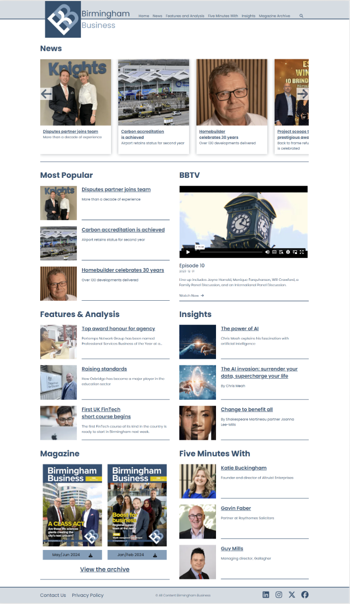

# Accessibility

Our project is committed to ensuring digital accessibility for people with disabilities. We are continually improving the user experience for everyone and applying the relevant accessibility standards.

## Conformance Status

We aim for our web content to be accessible according to the Web Content Accessibility Guidelines (WCAG) 2.1, level AA. These guidelines explain how to make web content more accessible for people with disabilities, and user friendly for everyone.

## Visual Testing

In this section, we provide visual evidence of the accessibility tests conducted during the development of our project. Screenshots and descriptions of the tests can help us track progress and identify any issues related to accessibility.

### Test 1: Contrast Ratio Check

_Description_: We tested the contrast ratio of text elements against their background colors using tools like Open CC Checker and WAVE chrome extension. The screenshot above shows an example of a successful test where the contrast ratio meets WCAG guidelines.

### Test 2: Keyboard Navigation

**Homepage**

**Story Page**

**Contact Page**

_Description_: We verified that all interactive elements (buttons, links, form fields) can be accessed and used via keyboard navigation. The screenshot demonstrates successful keyboard focus on a button.

### Test 3: Screen Reader Compatibility

<video controls src="public/assets/images/screen reader.mp4" title="screen reader"></video>

_Description_: We tested our project with screen readers, we used the tools NVDA and BrowserStack  to ensure proper announcements, semantic markup, and ARIA roles. The short video clip shows the screen reader reading out a navigation menu.

### Test 4: Responsive Design

<video controls src="public/assets/images/responsive-mobile.mp4" title="Title"></video>
<video controls src="public/assets/images/responsive-tablet.mp4" title="Title"></video>

_Description_: Our project was tested across various screen sizes and devices such as desktop, tablet and mobile. The screenshot and short video clips illustrates how the layout adapts responsively on different screens.

### Test 5: Accessibility Testing Results

**We have utilized the following tools and methods to assess our conformance:**

- **Lighthouse**

*Results*: Our application scored **96%** in accessibility audits, indicating strong adherence to WCAG guidelines.

- **WAVE (Web Accessibility Evaluation Tool)**

*Results*: No critical errors detected, minor issues addressed.

- **BrowserStack**

*Results*: No accessibility issues found on website scan.

## Compatibility with Browsers and Assistive Technology

Our project is designed to be compatible with the following assistive technologies:

- Browsers: Chrome, Firefox, Safari, Edge
- Screen readers: NVDA, JAWS, VoiceOver

## Technical Specifications

Accessibility of our project relies on the following technologies to work with the particular combination of web browser and any assistive technologies or plugins installed on your computer:

- HTML
- WAI-ARIA
- CSS
- JavaScript
- React

These technologies are relied upon for conformance with the accessibility standards used.

## Tools Used for Accessibility Evaluation

We have used the following tools to evaluate accessibility:

- **[WAVE](https://wave.webaim.org/extension/)** (Web Accessibility Evaluation Tool): A suite of evaluation tools that helps authors make their web content more accessible to individuals with disabilities.
- **[Lighthouse](https://chromewebstore.google.com/detail/lighthouse/blipmdconlkpinefehnmjammfjpmpbjk?hl=en)**: An open-source, automated tool for improving the quality of web pages, including performance, SEO, and accessibility.
- **[BrowserStack](https://www.browserstack.com/accessibility-testing)**: A platform for testing web applications across different browsers and operating systems, ensuring compatibility and accessibility.
- **[Accessibility Insights for Web](https://accessibilityinsights.io/docs/web/overview/)**: An extension for Chrome and Edge that enables developers to test web applications for accessibility issues.
- **[Open CC Checker](https://colourcontrast.cc/)**: This is a tool used to calculate the contrast ratio of text and background colors to ensure they meet the Web Content Accessibility Guidelines (WCAG) for readability. These tool is essential for designers and developers to make sure that their websites are accessible to users with visual impairments.

<section>

## Limitations and Alternatives

Despite our best efforts to ensure accessibility of our project, there may be some limitations. Below are a description of known limitations, and potential solutions.

- **Known limitation**: 
     1. Uploaded images may not have text alternatives because we cannot ensure the quality of contributions. 
     2. The business color scheme may not meet the color contrast ratio requirements for accessibility due to design.

- **Potential Solutions**: 
     1. The lack of text alternatives (such as alt text) for uploaded images can significantly impact accessibility. To address this issue:
      Automated Alt Text Generation: Consider implementing an automated system that generates basic alt text for images based on their content. 
      User-Provided Alt Text: Encourage contributors to provide descriptive alt text when uploading images. Include clear instructions or prompts during the upload process.
      Manual Review: Regularly review uploaded images and add or improve alt text where necessary. 
      Education and Awareness: Educate contributors about the importance of alt text and its impact on accessibility. Provide resources or guidelines on writing effective alt text.

     2. Inaccessible color contrast can make it difficult for users with visual impairments to read content. To improve color contrast:
     Evaluate Color Choices: Review the color scheme used in the design. Ensure that text and background colors have sufficient contrast (according to WCAG guidelines).
     Use Color Contrast Tools: Utilize online tools or browser extensions that check color contrast ratios. These tools can highlight problematic areas and suggest adjustments.
     Adjust Color Pairings: If certain color combinations fail the contrast ratio requirements, consider adjusting either the text color or the background color to improve readability.
     Test Across Devices: Test color contrast on various devices (desktop, mobile, etc.) and under different lighting conditions to ensure readability for all users.

</section>

## Further Information

For further information and resources on web accessibility, please visit:

- Web Accessibility Initiative (WAI)
- WebAIM Introduction to Web Accessibility

## Feedback

We welcome your [feedback](https://soc-hackathon-feedback.netlify.app/) on the accessibility of our project. Please let us know if you encounter accessibility barriers.

(<a href="#readme-top">back to top</a>)

