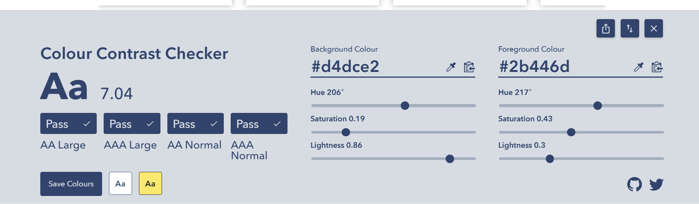
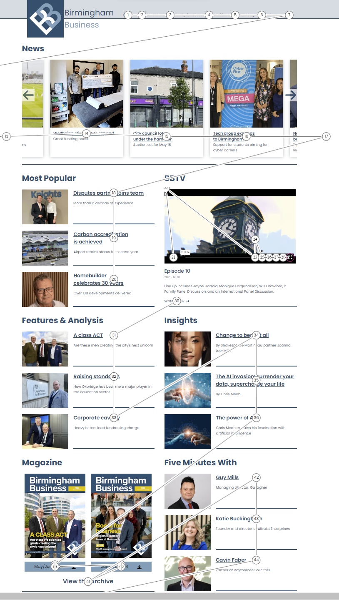
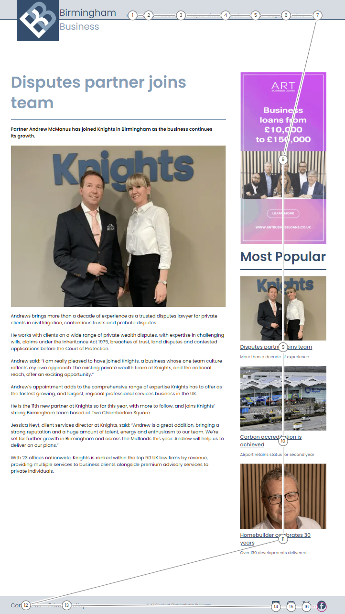
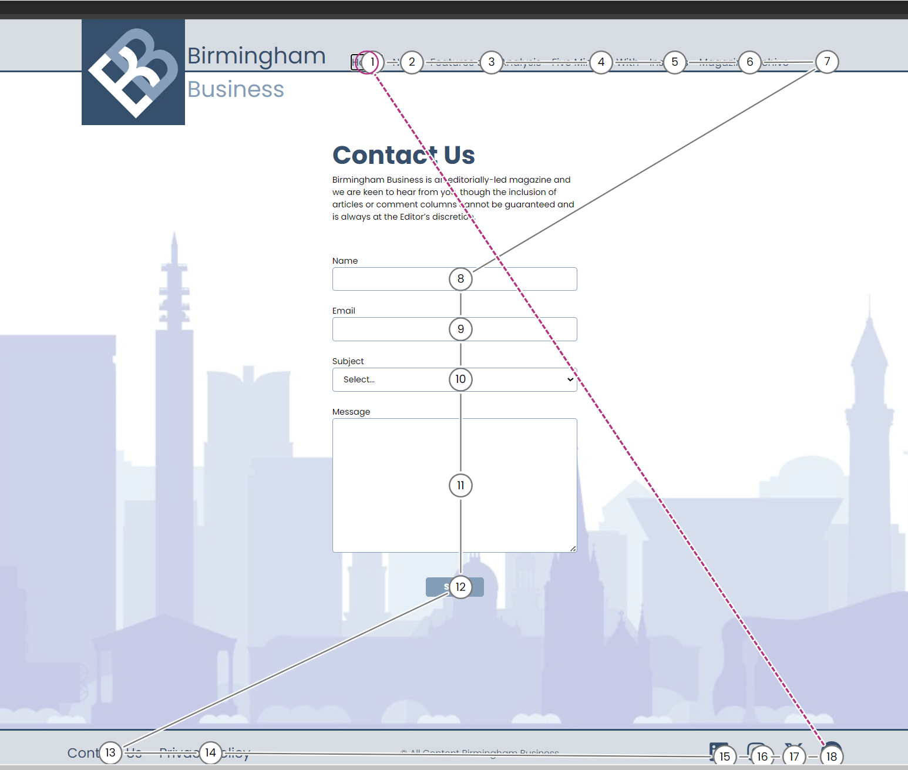
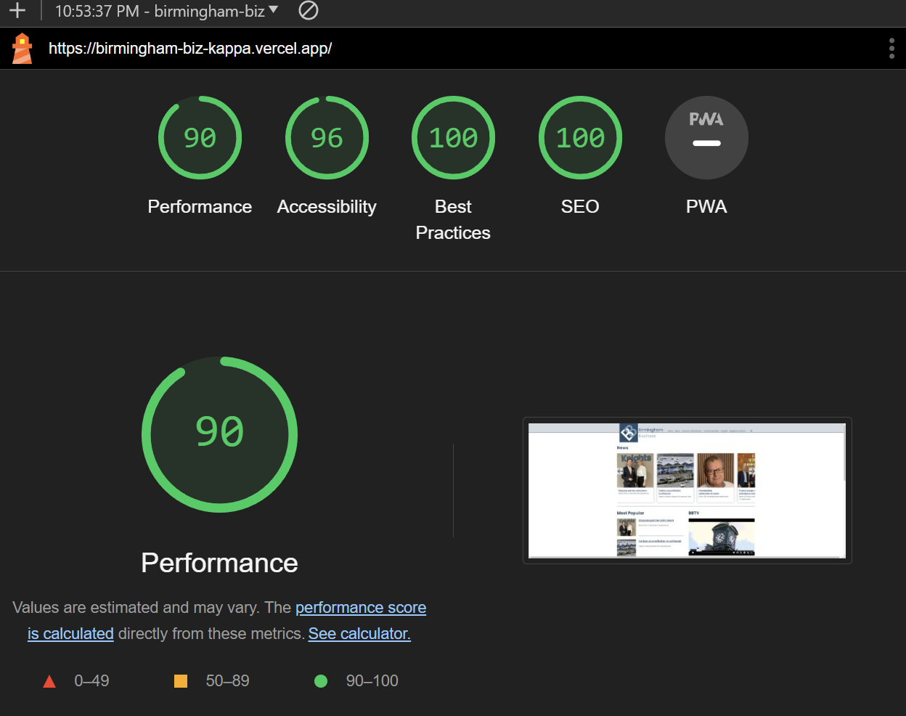
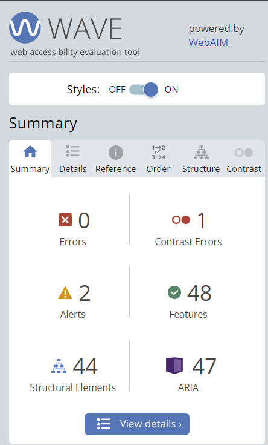
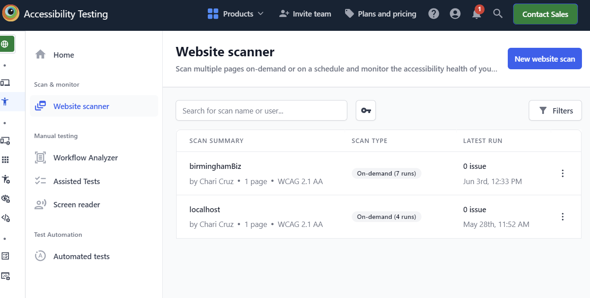

# Accessibility

Our project is committed to ensuring digital accessibility for people with disabilities. We are continually improving the user experience for everyone and applying the relevant accessibility standards.

## Conformance Status

We aim for our web content to be accessible according to the Web Content Accessibility Guidelines (WCAG) 2.1, level AA. These guidelines explain how to make web content more accessible for people with disabilities, and user friendly for everyone.

## Visual Testing

In this section, we provide visual evidence of the accessibility tests conducted during the development of our project. Screenshots and descriptions of the tests can help us track progress and identify any issues related to accessibility.

### Test 1: Contrast Ratio Check

_Description_: We tested the contrast ratio of text elements against their background colors using tools like Open CC Checker and WAVE chrome extension. The screenshot above shows an example of a successful test where the contrast ratio meets WCAG guidelines.

### Test 2: Keyboard Navigation

**Homepage**

**Story Page**

**Contact Page**

_Description_: We verified that all interactive elements (buttons, links, form fields) can be accessed and used via keyboard navigation. The screenshot demonstrates successful keyboard focus on a button.

### Test 3: Screen Reader Compatibility

<!-- add a short clip of the screen reader -->

_Description_: We tested our project with screen readers, we used the tools NVDA and BrowserStack  to ensure proper announcements, semantic markup, and ARIA roles. The short clip shows the screen reader reading out a navigation menu.

### Test 4: Responsive Design

<!-- add screenshot of mobile and desktop -->

_Description_: Our project was tested across various screen sizes and devices such as desktop, tablet and mobile. The screenshot illustrates how the layout adapts responsively on different screens.

### Test 5: Accessibility Testing Results

**We have utilized the following tools and methods to assess our conformance:**

- **Lighthouse**

*Results*: Our application scored an average of **96%** in accessibility audits, indicating strong adherence to WCAG guidelines.

- **WAVE (Web Accessibility Evaluation Tool)**
*Results*: No critical errors detected, minor issues addressed.

- **BrowserStack**
*Results*: No accessibility issues found on website scan.

## Compatibility with Browsers and Assistive Technology

Our project is designed to be compatible with the following assistive technologies:

- Browsers: Chrome, Firefox, Safari, Edge
- Screen readers: NVDA, JAWS, VoiceOver

## Technical Specifications

Accessibility of our project relies on the following technologies to work with the particular combination of web browser and any assistive technologies or plugins installed on your computer:

- HTML
- WAI-ARIA
- CSS
- JavaScript

These technologies are relied upon for conformance with the accessibility standards used.

## Tools Used for Accessibility Evaluation

We have used the following tools to evaluate accessibility:

- **WAVE** (Web Accessibility Evaluation Tool): A suite of evaluation tools that helps authors make their web content more accessible to individuals with disabilities.
- **Lighthouse**: An open-source, automated tool for improving the quality of web pages, including performance, SEO, and accessibility.
- **BrowserStack**: A platform for testing web applications across different browsers and operating systems, ensuring compatibility and accessibility.
- **Accessibility Insights for Web**: An extension for Chrome and Edge that enables developers to test web applications for accessibility issues.

## Limitations and Alternatives

Despite our best efforts to ensure accessibility of our project, there may be some limitations. Below is a description of known limitations, and potential solutions.

- **Known limitation 1**: Uploaded images may not have text alternatives because we cannot ensure the quality of contributions. 

## Further Information

For further information and resources on web accessibility, please visit:

- Web Accessibility Initiative (WAI)
- WebAIM Introduction to Web Accessibility

## Feedback

We welcome your feedback on the accessibility of our project. Please let us know if you encounter accessibility barriers:

- **Email**: CodeyMcCodeFace@email.com